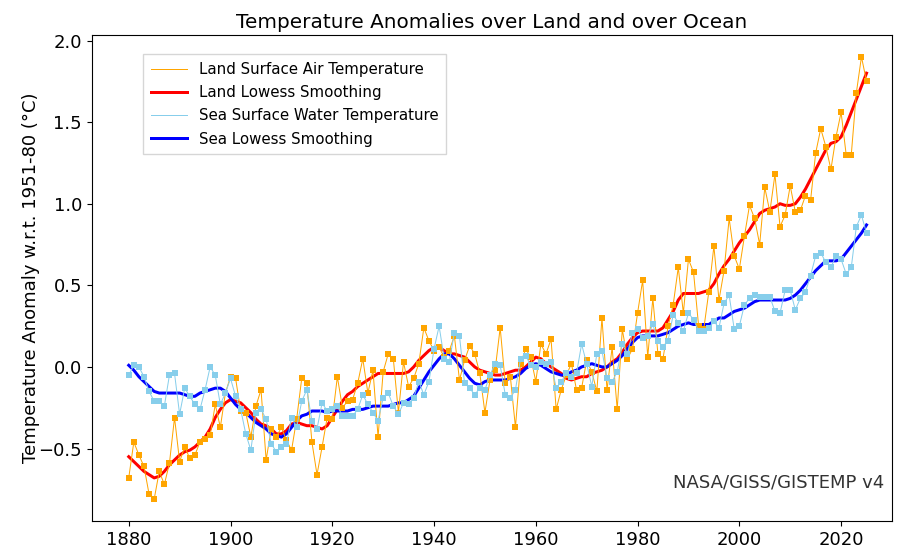
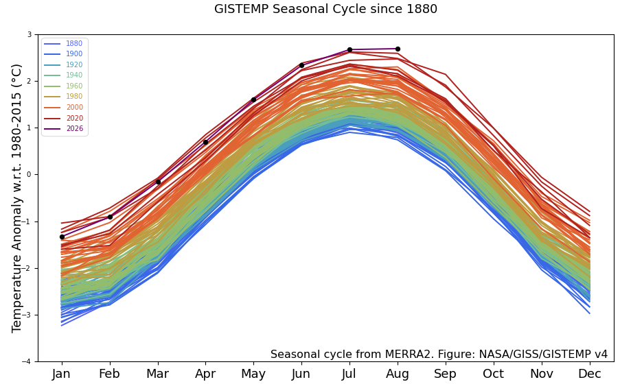
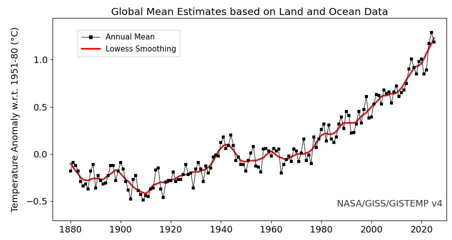
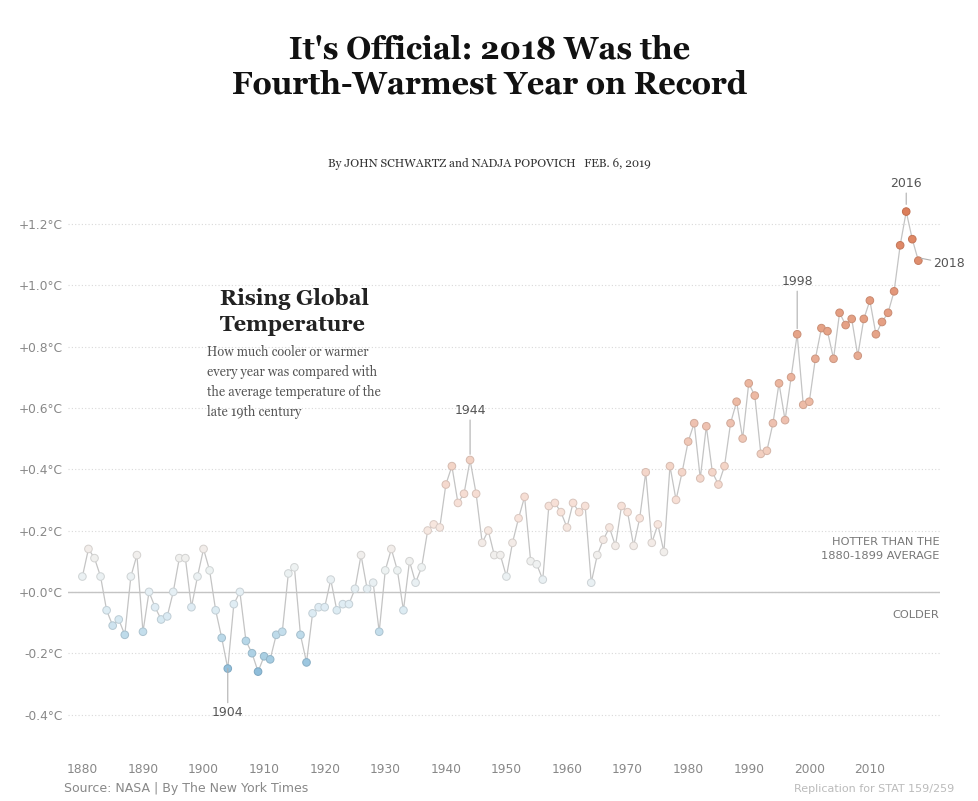

# Replicating Temperature Anomalies Graphics

**STAT 159/259 — Project 1**

## Executive summary

This project is a replication of four graphics that display global surface
temperature anomalies. The three underlying graphics were published by NASA's
Goddard Institute for Space Studies (GISS) as part of the GISTEMP v4 data
product; the fourth graphic is the *New York Times* chart published with the
article *"It's Official: 2018 Was the Fourth-Warmest Year on Record"*
(Schwartz and Popovich, February 6, 2019), which is a modified version of one
of the NASA graphics.

All data were downloaded directly from the official GISTEMP v4 data server
with `scripts/download_data.py` and stored in `data/`. Each graphic was
reproduced independently in its own notebook in `scripts/`, and every figure
was exported to both PNG and PDF in `outputs/`.

The replication reproduces the originals closely: the data, series, axis
ranges, colour schemes, line styles and annotation positions were recovered
from the published graphics. Two limitations are documented below: the grey
uncertainty band shown in NASA's third graphic is not included (the data are
not part of the published CSV), and the NYT chart is reproduced with data
through 2018 in order to match the original February 2019 article.

## Data

| File | Source graphic | Contents |
| --- | --- | --- |
| `data/land_ocean_anomalies.csv` | Graphic 1 | Annual anomalies over land and over ocean, and lowess smoothings (relative to 1951-1980) |
| `data/seasonal_cycle.csv` | Graphic 2 | Monthly anomalies since 1880, relative to 1980-2015 (MERRA2 seasonal cycle) |
| `data/global_annual_mean.csv` | Graphics 3 and 4 | Annual global mean anomalies and 5-year lowess smoothing (relative to 1951-1980) |

Source: NASA GISS, GISTEMP v4 — <https://data.giss.nasa.gov/gistemp/graphs_v4/>

## Graphic 1 — Temperature Anomalies over Land and over Ocean



The figure shows the annual mean land surface air temperature (orange) and sea
surface water temperature (sky blue) anomalies relative to the 1951-1980 mean,
together with a 5-year lowess smoothing of each series (red and blue). The
annual values are drawn as thin lines with square markers, the smoothings as
thick lines, exactly as in the NASA original. Both series warm over the record,
and the land surface warms noticeably faster than the ocean surface; the land
series is also much more variable, especially in the early decades when the
observational network was sparse.

## Graphic 2 — GISTEMP Seasonal Cycle since 1880



This figure shows the seasonal cycle of global surface temperature. Every year
is one line across the twelve months, and lines are coloured in 20-year bins
from blue (1880-1899) through green and orange to dark red (2020-2025), with
the current partial year (2026) in purple and marked with black dots. All years
share the same seasonal shape, but the whole family of curves shifts upward
over time: the recent curves sit 2-3 °C above the earliest curves in every
month. The data are monthly anomalies relative to the 1980-2015 base period.

## Graphic 3 — Global Mean Estimates based on Land and Ocean Data



The figure shows the annual global mean surface temperature anomaly (the
Land-Ocean Temperature Index) as a thin black line with square markers,
together with the red 5-year lowess smoothing. The annual values oscillate
around the trend line, which rises from about -0.3 °C in the late 19th century
to about +1.2 °C in 2025 relative to the 1951-1980 mean.

**Documented deviation:** the official NASA version of this graphic also
contains a light-grey *LSAT+SST Uncertainty* band. That band is derived from a
separate GISTEMP uncertainty product (Lenssen et al., 2024) and its values are
not included in the `graph.csv` file distributed with the graphic, so the band
is omitted here.

## Graphic 4 — The New York Times "Rising Global Temperature"



This is the chart from the *New York Times* article of February 6, 2019. It is
a modified version of Graphic 3:

- each year is a dot connected by a light-grey line;
- values are expressed relative to the **1880-1899 average** instead of the
  NASA 1951-1980 base period (the 1880-1899 mean of the index is -0.23 °C);
- the dots use a blue-to-orange colour scale centred on the 1951-1980
  anomaly of 0 °C;
- the years 1904, 1944, 1998, 2016 and 2018 are annotated, and the chart
  carries the article headline, byline and source line.

The figure makes the article's comparison explicit: 2016 (+1.24 °C) and 2018
(+1.08 °C) are far above the late-19th-century average, while 1904 (-0.25 °C)
is one of the coldest years on record. To reproduce the original article
graphic, the data are restricted to 1880-2018.

## Reproducing this project

```bash
python3 -m venv .venv
source .venv/bin/activate
pip install -r requirements.txt
python scripts/download_data.py
jupyter nbconvert --execute --inplace scripts/*.ipynb
```

Running the four notebooks regenerates every figure in `outputs/` (PNG and
PDF) and renders them inline in the notebooks.

## Repository layout

```
temperature-anomalies/
├── README.md
├── requirements.txt
├── .gitignore
├── data/                          # raw CSV files from NASA GISTEMP v4
├── scripts/
│   ├── download_data.py           # downloads the raw data
│   ├── 01_land_ocean_anomalies.ipynb
│   ├── 02_seasonal_cycle.ipynb
│   ├── 03_global_annual_mean.ipynb
│   └── 04_nyt_chart.ipynb
├── outputs/                       # PNG and PDF versions of the four figures
├── report/
│   └── report.md                  # this document


## References

- GISTEMP Team, *GISS Surface Temperature Analysis (GISTEMP), version 4*,
  NASA Goddard Institute for Space Studies,
  <https://data.giss.nasa.gov/gistemp/>.
- Lenssen, N., Schmidt, G., Hansen, J., Menne, M., Pershing, A., Ruedy, R.,
  Schlinger, D. (2019). *Improvements in the GISTEMP uncertainty model*,
  J. Geophys. Res. Atmos., 124(12), 6307-6326.
- Schwartz, J. and Popovich, N. (2019). *It's Official: 2018 Was the
  Fourth-Warmest Year on Record*, The New York Times, February 6, 2019.
